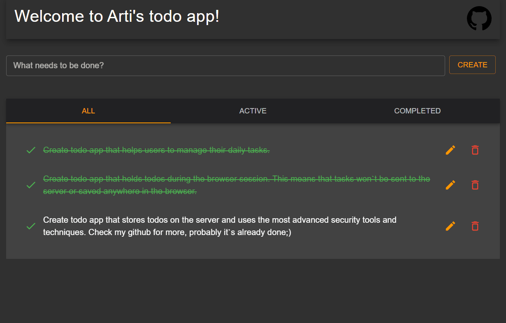

## Arti's Todo app
Check out [deploy](https://lartiquel.github.io/react-todo-app/).

<p align="center">
  
</p>

### Technologies used:
* React(Hooks only).
* Redux.
* Material UI.

### How to run app on my computer?
```
Run following commands:
git clone https://github.com/lArtiquel/react-todo-app.git
cd react-todo-app
npm install
npm run start
```

**Note:**
Todo app remembers todos only during the browser session.
This means that tasks won't be saved neither somewhere on server nor in browser.
There will be one more todo app that will be storing todos on the server, but not this one.

If you liked this app, feel free to leave a star.

***Best Regards, Arti Tsv.***